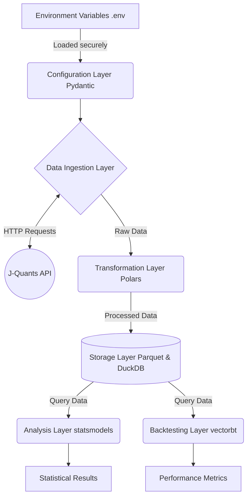

# Japanese Stock Calendar Anomaly Validation System

A robust, mathematically sound Proof of Concept (PoC) for ingesting, transforming, and analyzing calendar anomalies within Japanese equity markets. It leverages modern Python tools (Polars, DuckDB, vectorbt) to process live data from the J-Quants API, performing rigorous statistical tests and backtesting trading strategies.


## Key Features

- **Automated Data Pipeline**: Seamlessly fetches the last 12 weeks of daily quotes from the J-Quants API with robust retry logic and error handling.
- **High-Performance Transformations**: Utilizes Polars to rapidly compute daily, intraday, and overnight returns, along with calendar features (day-of-week, month-start/end).
- **Zero-Config Storage**: Transparently saves processed data as heavily compressed Parquet files queryable instantly via DuckDB.
- **Rigorous Statistical Validation**: Employs `statsmodels` to scientifically test hypotheses regarding market returns on specific days.
- **Realistic Backtesting**: Integrates `vectorbt` to simulate calendar-based trading strategies, perfectly accounting for transaction fees and slippage.

## Architecture Overview

The system strictly decouples the volatile external API integration from the highly sensitive internal statistical logic using a layered approach enforcing strict Pydantic data schemas.



## Prerequisites

- Python 3.12+
- `uv` (for rapid dependency management)
- Optional: A valid J-Quants API free-tier account (Refresh Token) for live execution.

## Installation & Setup

1. Clone the repository:
```bash
git clone <repository_url>
cd <repository_directory>
```

2. Install dependencies using `uv`:
```bash
uv sync
```

3. Configure Environment Variables:
```bash
cp .env.example .env
```
Edit the `.env` file and append your J-Quants API refresh token: `JQUANTS_REFRESH_TOKEN=your_token_here`.

## Usage

### Quick Start with Marimo

The entire UAT and tutorial suite is packaged in a single, reactive Marimo notebook. It supports both Mock Mode (no API key required) and Real Mode.

```bash
uv run marimo edit tutorials/UAT_AND_TUTORIAL.py
```

### Standard Execution

Execute the main pipeline directly to fetch data, run statistics, and output backtest metrics to the console.

```bash
uv run python main.py
```

### Python Snippet: Statistical Evaluation and Backtesting

You can also use the analytical components directly in your own scripts:

```python
import polars as pl
from src.analysis.statistics import evaluate_day_anomaly
from src.analysis.backtest import run_backtest

# Load your historical data into a Polars DataFrame
df = pl.DataFrame({
    "close": [100.0, 105.0, 102.0, 110.0, 115.0],
    "return": [0.0, 0.05, -0.028, 0.078, 0.045],
    "day_of_week": [1, 2, 3, 4, 5]
})

# 1. Statistical Evaluation (e.g., testing Monday anomalies)
stat_result = evaluate_day_anomaly(df.to_pandas(), target_day=1)
print(f"Is Monday Significant? {stat_result.is_significant} (p-value: {stat_result.p_value})")

# 2. Algorithmic Backtesting
if stat_result.is_significant:
    # Buy on Friday, Sell on Monday
    metrics = run_backtest(df, entry_day=5, exit_day=1, initial_cash=1000000.0, fees=0.001)
    print(f"Total Return: {metrics.total_return}%")
    print(f"Sharpe Ratio: {metrics.sharpe_ratio}")
```

## Development Workflow

The project strictly enforces code quality using `ruff` (max complexity 10) and `mypy` (strict mode). All configurations are defined in `pyproject.toml`.

- **Run Linters and Type Checkers**:
```bash
uv run ruff check .
uv run mypy .
```

- **Run Tests (with Coverage)**:
```bash
uv run pytest
```
*Note: The test suite aggressively mocks external API calls to guarantee sandbox resilience and rapid execution.*

## Project Structure

```text
src/
├── core/            # Pydantic configuration & exceptions
├── domain/          # Strict Pydantic models & schemas
├── ingestion/       # J-Quants API client and fetch logic
├── processing/      # Polars transformations and feature engineering
├── storage/         # DuckDB repository and Parquet file I/O
└── analysis/        # statsmodels and vectorbt integrations
tests/               # Pytest suite with strict mocking
tutorials/           # Marimo UAT notebooks
dev_documents/       # Architectural plans and specifications
```

## License

MIT
