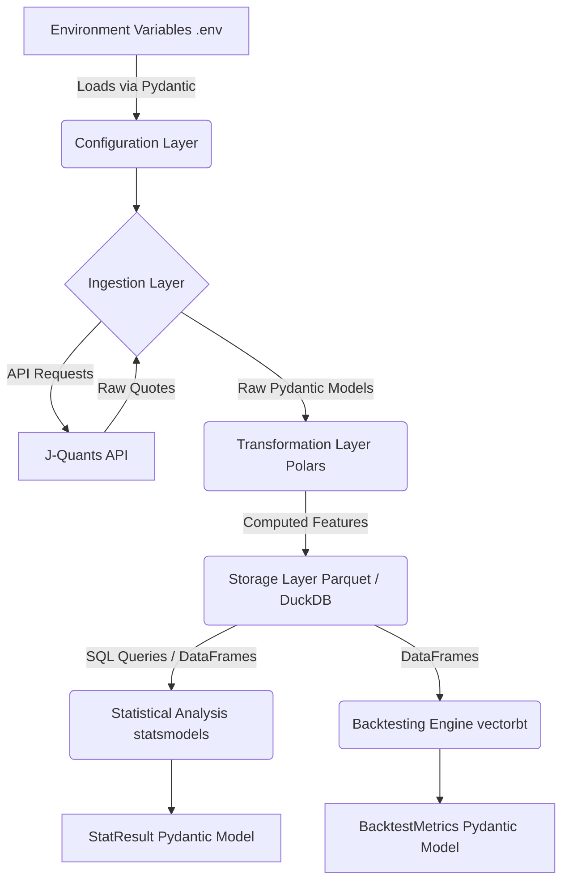

# Japanese Stock Calendar Anomaly Verification System

A Proof of Concept (PoC) automated pipeline designed to retrieve historical Japanese stock data, analyze calendar anomalies (such as the "Monday effect"), and rigorously backtest trading strategies.


## Key Features
- **Automated Data Ingestion**: Securely connects to the J-Quants API (Free Tier) to fetch live historical daily quotes. Features built-in resilience and retry logic to gracefully handle rate limits and API outages.
- **High-Performance Transformations**: Leverages Polars for lightning-fast feature engineering, dynamically calculating essential analytical metrics like day-of-week, month boundaries, and intraday returns.
- **Scalable Storage**: Utilizes DuckDB and Parquet files for highly compressed, locally queryable analytical data storage.
- **Statistical Rigor**: Integrates `statsmodels` to mathematically verify the significance of calendar anomalies using hypothesis testing.
- **Algorithmic Backtesting**: Integrates the `vectorbt` engine to simulate real-world trading strategies (e.g., "Buy Monday Open, Sell Friday Close"), producing accurate performance metrics including Sharpe Ratios, taking into account slippage and transaction fees.
- **Interactive Verification**: Provides a comprehensive Marimo notebook (`tutorials/UAT_AND_TUTORIAL.py`) allowing analysts to seamlessly execute the pipeline, visualize the data, and review backtest results in an interactive environment.

## Architecture Overview
This system adopts a strictly decoupled, layered architecture connected by robust Pydantic data models. It consists of Configuration, Ingestion, Transformation, Storage, and Analysis layers.



## Prerequisites
- **Python**: Version 3.12 or higher.
- **Dependency Manager**: `uv` is highly recommended for managing dependencies.
- **J-Quants API Key**: A valid refresh token from the J-Quants API (Free tier is sufficient).

## Installation & Setup

1. **Clone the repository:**
   ```bash
   git clone <repository_url>
   cd <repository_directory>
   ```

2. **Install dependencies using uv:**
   ```bash
   uv sync
   ```

3. **Configure Environment Variables:**
   Copy the example environment file and insert your J-Quants API Refresh Token.
   ```bash
   cp .env.example .env
   # Edit .env and add your token to JQUANTS_REFRESH_TOKEN
   ```

## Usage

### Running the Interactive Tutorial (UAT)
The primary way to interact with and verify the system is via the Marimo notebook.

```bash
uv run marimo edit tutorials/UAT_AND_TUTORIAL.py
```
This single file provides a complete walkthrough:
- Authenticates with the API.
- Ingests data.
- Processes the data using Polars.
- Executes statistical tests on specific days.
- Runs an algorithmic backtest simulation.

*Note: If a `.env` file is not present, the tutorial will gracefully degrade into "Mock Mode," using synthetic data to ensure functionality can be evaluated without real credentials.*

### Running the Full Pipeline Programmatically
You can execute the entire pipeline end-to-end via the provided orchestration script.

```bash
uv run python -m src.pipeline
```

## Development Workflow

### Testing
This project utilizes `pytest` with `pytest-cov` for testing, ensuring high test coverage across all modules. Specific live integration tests require the `.env` file to be populated, while unit tests enforce strict mocking.

```bash
# Run all tests (including coverage report)
uv run pytest
```

### Linting & Formatting
Code quality is strictly enforced using `ruff` and `mypy` (in strict mode).

```bash
# Run type checking
uv run mypy .

# Run linting and apply safe fixes
uv run ruff check . --fix
```

## Project Structure
```text
├── .env.example
├── README.md
├── pyproject.toml
├── src/
│   ├── config/             # Settings and Env management
│   ├── domain/             # Pydantic Schemas (Contracts)
│   ├── ingestion/          # J-Quants API Client
│   ├── transformation/     # Polars Feature Engine
│   ├── storage/            # DuckDB and Parquet Storage
│   ├── analysis/           # Statistical Testing & Backtesting
│   └── pipeline.py         # Main orchestration Facade
├── tests/                  # Pytest Unit and Integration tests
└── tutorials/
    └── UAT_AND_TUTORIAL.py # Marimo interactive UAT notebook
```

## License
MIT License