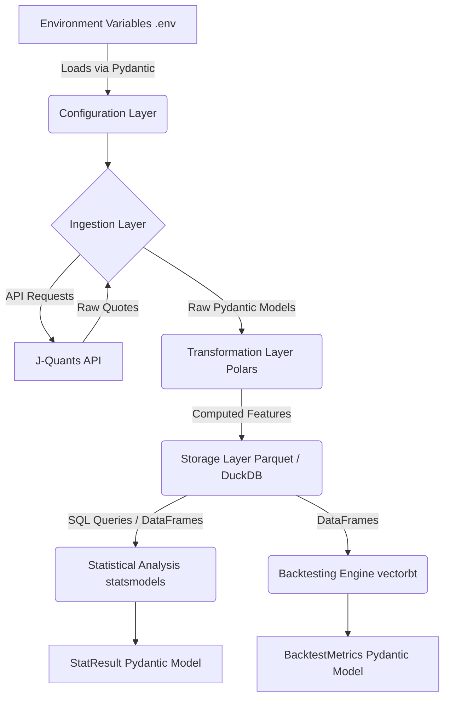

# System Architecture: Japanese Stock Calendar Anomaly Verification System

## Summary
The Japanese Stock Calendar Anomaly Verification System is a Proof of Concept (PoC) designed to retrieve, process, and analyse historical stock data from the J-Quants API. It leverages modern data processing tools—Polars for rapid data manipulation, DuckDB for local scalable analytical queries, and vectorbt for high-performance algorithmic backtesting. The overarching goal of this system is to identify and verify the statistical significance of calendar anomalies, specifically focusing on the "day of the week" effect in the Japanese stock market. By executing end-to-end pipelines that fetch live data, transform it, conduct statistical tests, and simulate trading strategies, researchers and quantitative analysts can gain actionable insights into market behaviour.

## System Design Objectives
The primary objective of this system is to establish a reliable, automated pipeline that ingests daily stock data, calculates necessary financial metrics, and rigorously tests for statistical calendar anomalies. The architecture must strictly separate concerns, ensuring that data ingestion, transformation, storage, statistical testing, and backtesting operate independently while seamlessly communicating via well-defined Pydantic schema contracts.

**Constraints:**
- **External Dependency Control:** The system heavily relies on the J-Quants API (Free tier). It must implement robust retry and error-handling logic to manage rate limits and network anomalies gracefully.
- **Resource Efficiency:** Leveraging Polars and DuckDB, the system must process data efficiently in-memory and on-disk without requiring heavy database installations.
- **Security:** Strict separation of credentials is required. API keys and refresh tokens must never be hardcoded and should be accessed strictly via environment variables (using `python-dotenv`).

**Success Criteria:**
1. Successful, authenticated retrieval of 12 weeks of historical Japanese stock quotes from the J-Quants API.
2. Accurate transformation of raw data into analytical datasets containing features such as day-of-week flags, month-start/end flags, daily returns, intraday returns, and overnight returns.
3. Persistent storage of these datasets in Parquet format, allowing seamless DuckDB queries.
4. Execution of robust statistical tests that quantify the significance of day-of-week returns using `statsmodels`.
5. A working backtesting simulation using `vectorbt` that executes "Buy Monday Open, Sell Friday Close" (or similar strategies), factoring in slippage and transaction costs, and produces key performance metrics like Sharpe Ratios and Win Rates.

## System Architecture
The system follows a modern, decoupled architecture, breaking down operations into distinct layers: Configuration, Ingestion, Transformation, Storage, and Analysis.

- **Configuration Layer:** Manages environment variables and application settings using Pydantic. It ensures all necessary secrets (e.g., `JQUANTS_REFRESH_TOKEN`) are securely loaded into the system without being exposed in the code.
- **Ingestion Layer:** Connects to the J-Quants API, handles authentication (exchanging the refresh token for a session token), and retrieves paginated or time-bound historical stock quotes. This layer includes retry mechanisms to ensure resilience.
- **Transformation Layer:** Utilises Polars to clean the raw JSON data and compute essential features. It handles the mathematical calculations for returns (close-to-close, open-to-close, close-to-open) and generates time-based flags.
- **Storage Layer:** Writes the transformed Polars DataFrames into highly compressed, columnar Parquet files. DuckDB acts as an in-process SQL execution engine against these Parquet files, providing a unified query interface.
- **Analysis Layer:** Divided into two sub-components:
  - **Statistical Testing:** Takes the query results and applies statistical models (e.g., T-tests or ANOVA) via `statsmodels` to determine the validity of anomalies.
  - **Backtesting Engine:** Translates the DataFrames into formats readable by `vectorbt`, simulates trading signals based on calendar anomalies, and generates performance metrics.

**Boundary Management and Separation of Concerns:**
To prevent the emergence of "God Classes," the system mandates strict boundaries. The Ingestion Layer must only return raw Pydantic models representing external API responses. It must not perform complex mathematical transformations. The Transformation Layer receives raw data, processes it, and outputs domain-specific Pydantic models. The Analysis Layer consumes the finalised dataset independently. External systems (like the J-Quants API) are only accessed through specific repository classes.



## Design Architecture
The design relies heavily on strong typing and validation through Pydantic models, serving as the connective tissue between the decoupled modules.

```text
├── .env.example
├── README.md
├── pyproject.toml
├── src/
│   ├── __init__.py
│   ├── config/
│   │   ├── __init__.py
│   │   └── settings.py
│   ├── domain/
│   │   ├── __init__.py
│   │   ├── raw_quote.py
│   │   └── transformed_quote.py
│   ├── ingestion/
│   │   ├── __init__.py
│   │   └── jquants_client.py
│   ├── transformation/
│   │   ├── __init__.py
│   │   └── feature_engine.py
│   ├── storage/
│   │   ├── __init__.py
│   │   └── parquet_duckdb.py
│   ├── analysis/
│   │   ├── __init__.py
│   │   ├── stats_tester.py
│   │   └── backtester.py
│   └── pipeline.py
├── tests/
│   ├── __init__.py
│   ├── conftest.py
│   ├── test_ingestion.py
│   ├── test_transformation.py
│   └── test_analysis.py
└── tutorials/
    └── UAT_AND_TUTORIAL.py
```

**Core Domain Pydantic Models Structure:**
1.  **AppSettings (`src/config/settings.py`)**: Defines system configurations, including `JQUANTS_REFRESH_TOKEN` and logging levels.
2.  **RawQuote (`src/domain/raw_quote.py`)**: Represents the exact JSON structure returned by the J-Quants API (Date, Open, High, Low, Close, Volume).
3.  **TransformedQuote (`src/domain/transformed_quote.py`)**: Extends the concept of a quote by appending calculated fields. It inherits core attributes and adds `day_of_week` (int), `is_month_start` (bool), `is_month_end` (bool), `daily_return` (float), `intraday_return` (float), and `overnight_return` (float).
4.  **StatResult (`src/analysis/stats_tester.py`)**: Captures the results of the statistical test, including the T-statistic, P-value, and a boolean indicating significance.
5.  **BacktestMetrics (`src/analysis/backtester.py`)**: Stores the final metrics from `vectorbt`, including `sharpe_ratio`, `win_rate`, `total_return`, and `max_drawdown`.

## Implementation Plan

### CYCLE01
- **Focus:** Data Pipeline Construction (ETL & Storage).
- **Features:**
  1. Setup of the core Pydantic configurations and environment variable management to securely load `JQUANTS_REFRESH_TOKEN`.
  2. Implementation of the `jquants_client` module to authenticate with the J-Quants API and fetch 12 weeks of historical daily stock data. This will include sophisticated error handling and retry logic to gracefully manage rate limits or temporary API outages.
  3. Development of the `feature_engine` using Polars to ingest the raw J-Quants data and generate critical features: day of the week flag (1-5), month start/end flags, and various return metrics (daily, intraday, overnight).
  4. Construction of the `parquet_duckdb` storage module to save the resulting Polars DataFrames as Parquet files to the local disk and instantiate a DuckDB connection for subsequent querying.

### CYCLE02
- **Focus:** Backtesting and Statistical Validation (Analysis).
- **Features:**
  1. Development of the `stats_tester` module. This module will load the transformed data from the DuckDB/Parquet storage layer and use `statsmodels` to perform a statistical test, verifying whether the distribution of returns on specific days (e.g., Mondays) shows statistically significant deviation from other days.
  2. Construction of the `backtester` module using `vectorbt`. This engine will convert the Polars DataFrame into the required format, ingest generated signals (e.g., "Buy Monday Open, Sell Friday Close"), factor in transaction fees and slippage, and simulate the trading strategy.
  3. Creation of the `BacktestMetrics` and `StatResult` Pydantic models to strictly structure the outputs of the analysis.
  4. Integration of the complete pipeline, allowing a seamless run from data ingestion to backtest metric generation.

## Test Strategy

### CYCLE01
- **Unit Testing:** Individual unit tests will focus on validating the logic within the Polars transformations (`feature_engine`) using small, synthetic datasets. Mocking will be strictly enforced for the `jquants_client` unit tests. We will use `pytest-mock` to intercept requests to the J-Quants API, returning predefined JSON structures to verify that the client parses responses correctly and handles simulated HTTP errors without executing actual network calls.
- **Integration Testing:** A live integration test will be developed to hit the real J-Quants API. This test will verify that the end-to-end ETL flow functions correctly against live infrastructure. It will check if the authentication token is successfully exchanged, data is downloaded, transformed, and finally saved to disk as a Parquet file.
- **DB Rollback Rule:** For tests involving the DuckDB storage module, a Pytest fixture will be utilised to create an isolated, in-memory DuckDB connection. This connection will be initialized before each test and discarded afterward, guaranteeing lightning-fast state resets and preventing cross-test contamination without the need for complex file cleanup operations. Temporary directories will be used when physical Parquet file creation must be verified.

### CYCLE02
- **Unit Testing:** Unit tests for the `stats_tester` will provide statically defined DataFrames where statistical significance is mathematically guaranteed (both significant and insignificant scenarios) to ensure `statsmodels` correctly identifies them. The `backtester` module will be tested by providing simple, predictable price series and deterministic signals to verify that `vectorbt` calculates the Sharpe ratio, total return, and win rate accurately, including the correct deduction of transaction fees.
- **Integration Testing:** The full pipeline will be tested by passing historical, cached Parquet data through the statistical and backtesting engines. This ensures that the outputs of Cycle 1 are perfectly compatible with the inputs required by Cycle 2 modules.
- **E2E Testing / UAT:** The final executable UAT notebook (`UAT_AND_TUTORIAL.py`) will be executed to guarantee the entire system works cohesively.
- **DB Rollback Rule:** Similar to Cycle 1, any test relying on querying historical data via DuckDB will use transient, in-memory database connections populated from temporary Parquet files, ensuring complete isolation and rapid execution.
