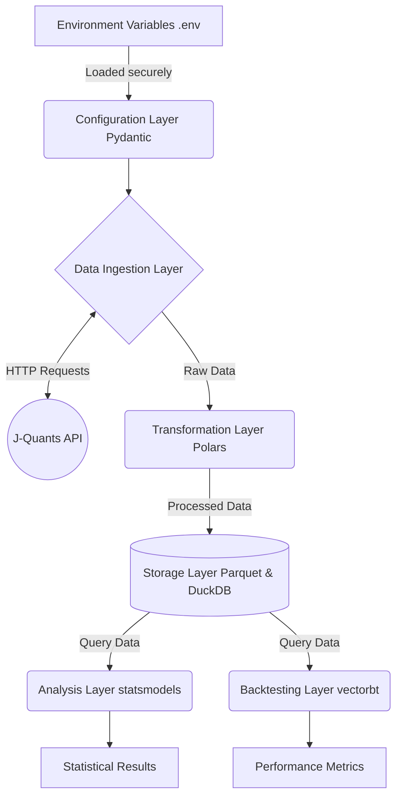

# System Architecture Document

## Summary
The system aims to construct a Proof of Concept (PoC) for analysing calendar anomalies within Japanese stocks. It utilises a modern technology stack, specifically Python, Polars, DuckDB, and vectorbt. The core functionality centres around fetching live market data from the J-Quants API (Free tier), processing it, storing it locally, and subsequently applying statistical tests and backtesting strategies. The application requires an end-to-end integration with the real J-Quants API, whilst maintaining a high standard of security and separation of concerns.

## System Design Objectives
The primary objective of this system is to provide a robust, reliable, and scalable foundation for quantitative research, specifically focusing on the validation of calendar anomalies in the Japanese equity market. The design must adhere to strict principles of separation of concerns, ensuring that individual modules are cohesive and loosely coupled. This approach facilitates easier maintenance, testing, and future extensibility. We are establishing a system that is not merely a collection of scripts, but a well-architected pipeline capable of handling live financial data with precision and care.

A critical objective is the secure and effective management of credentials. The system must never hardcode sensitive information such as the J-Quants API refresh tokens. Instead, it must rely entirely on environment variables, loaded securely via `python-dotenv` or an equivalent mechanism governed by Pydantic configuration models. This ensures that the application can be safely deployed and shared without exposing sensitive access keys. Furthermore, the system must incorporate robust error handling and retry mechanisms. When interacting with external web services like the J-Quants API, transient network failures and rate limits are inevitable. The system must anticipate these issues and gracefully recover, preventing catastrophic failures and ensuring the continuity of the data ingestion process. The ingestion logic must also dynamically calculate the date ranges, ensuring that the script can be executed on any given day to retrieve the most recent twelve weeks of data without requiring manual intervention or hardcoded timestamps.

The performance and efficiency of data processing are also paramount objectives. By leveraging Polars, the system will achieve high-performance data manipulation, calculating necessary features such as day-of-week indicators, start-of-month and end-of-month flags, and various return metrics (daily, intraday, overnight) with optimal speed. The processed data must then be stored efficiently using the Parquet format, which offers excellent compression and read performance. DuckDB will subsequently be employed to provide an SQL-like interface for querying this stored Parquet data, enabling fast and flexible data retrieval for the subsequent analysis phases.

Another fundamental objective is to provide a mathematically sound and rigorous environment for statistical testing. The system must implement statistical tests to determine if the returns observed on specific days of the week are significantly different from the overall distribution. This requires the integration of reliable statistical libraries and the careful preparation of the data to ensure the validity of the tests. Following the statistical validation, the system must offer a comprehensive backtesting engine. By converting the Polars dataframes into a format compatible with `vectorbt`, the system will simulate trading strategies based on the identified anomalies. The backtesting engine must account for real-world frictions, including transaction fees and slippage, to provide a realistic assessment of the strategy's potential profitability. The system must ultimately output key performance indicators, such as the Sharpe ratio, win rate, and total return, enabling the user to evaluate the efficacy of the proposed calendar anomaly strategy.

In summary, the design objectives prioritise security, resilience, performance, and analytical rigour. The system must cleanly separate the data ingestion, processing, storage, statistical testing, and backtesting concerns, adhering to a modular architecture that supports thorough testing and future enhancements. By achieving these objectives, the system will deliver a highly capable PoC that accurately and reliably evaluates calendar anomalies in the Japanese stock market.

## System Architecture
The system architecture is designed around a clear, modular pipeline that strictly separates data ingestion, transformation, storage, and analysis. This pipeline is composed of several distinct layers, each responsible for a specific aspect of the overall process. This separation of concerns ensures that the system avoids monolithic "God Classes" and instead relies on highly cohesive and loosely coupled components. The architecture is built to be resilient, performant, and easily testable.

At the very front of the system is the Configuration Layer. This layer is responsible for securely loading and managing all environment variables, specifically the J-Quants API credentials. It uses Pydantic's `BaseSettings` to define a strict schema for the configuration, ensuring that the application will fail fast if required credentials are missing or improperly formatted. This layer ensures that sensitive information is never hardcoded and is only accessed dynamically at runtime.

The next component is the Data Ingestion Layer. This layer is responsible for interacting with the external J-Quants API. It handles authentication, token management, and the retrieval of daily stock data. A crucial aspect of this layer is its resilience; it must implement robust retry logic and exponential backoff strategies to gracefully handle rate limits and transient network errors. It is designed to dynamically request the latest twelve weeks of data, ensuring the system remains up-to-date regardless of the execution date. The ingestion layer acts as the boundary between the external world and the internal system, ensuring that raw data is reliably sourced.

Once the raw data is ingested, it is passed to the Transformation Layer. This layer utilises the high-performance Polars library to clean and enrich the data. It applies necessary transformations, such as calculating daily returns, intraday returns, and overnight returns. Furthermore, it extracts and appends crucial temporal features, such as day-of-week flags and indicators for the start and end of the month. The transformation layer ensures that the raw data is structured and enriched appropriately for the subsequent analysis phases.

Following transformation, the data enters the Storage Layer. The processed Polars dataframe is serialized and saved to the local filesystem using the highly efficient Parquet format. This format provides excellent compression and fast read access. To facilitate flexible querying, DuckDB is integrated into this layer, allowing the system to execute SQL queries directly against the stored Parquet files. This approach provides a lightweight yet powerful mechanism for managing and accessing the historical data without the need for a heavy, dedicated database server.

The final layer is the Analysis and Backtesting Layer. This component retrieves the structured data via DuckDB and performs rigorous statistical and financial analysis. It utilises `statsmodels` to conduct statistical tests, determining the significance of returns on specific days of the week. Simultaneously, it feeds the data into the `vectorbt` engine to simulate trading strategies based on the identified anomalies. This layer accounts for transaction costs and slippage, ultimately producing a comprehensive set of performance metrics, such as the Sharpe ratio and win rate.



This architecture explicitly defines boundaries. The external API interactions are isolated in the ingestion layer, while complex data manipulation is confined to the transformation layer. This ensures that a change in the external API structure only requires an update to the ingestion layer, leaving the rest of the system unaffected. This modularity is a cornerstone of the system's design, guaranteeing a robust and maintainable application.

## Design Architecture
The design architecture is deeply rooted in the principles of Domain-Driven Design, leveraging Pydantic models to strictly define the structure, typing, and validation rules of the core domain objects. This approach ensures that data flowing through the system is always in a known, valid state, thereby preventing unexpected errors and enhancing overall system stability. The file structure is organised to reflect these domain boundaries and architectural layers perfectly. We mandate that the system must avoid implicit assumptions about the data schema at all costs. Instead, every piece of data must pass through rigorous validation gates enforced by Pydantic before it is allowed to progress further down the processing pipeline.

```text
src/
├── core/
│   ├── config.py
│   └── exceptions.py
├── domain/
│   ├── models.py
│   └── schemas.py
├── ingestion/
│   ├── jquants_client.py
│   └── fetcher.py
├── processing/
│   ├── features.py
│   └── transformers.py
├── storage/
│   ├── repository.py
│   └── duckdb_client.py
└── analysis/
    ├── statistics.py
    └── backtest.py
```

The `domain/models.py` file is the heart of the system's data definition. It contains Pydantic models that represent the fundamental entities of the application. For instance, a `RawQuote` model defines the expected structure of data received from the J-Quants API, ensuring that fields like date, open, high, low, close, and volume are present and of the correct data type. If the API returns unexpected data types, Pydantic will immediately raise a validation error, preventing corrupt data from entering the transformation pipeline. Furthermore, a `ProcessedQuote` model extends the `RawQuote` by adding fields for the calculated features, such as `day_of_week` (constrained to integers 1 through 5), `is_month_start`, and various return metrics. This clear inheritance and extension demonstrate how new schema objects build upon existing ones, maintaining a cohesive domain model. The models also define crucial invariants, such as ensuring that the high price is always greater than or equal to the low price, providing an extra layer of logical safety.

The `core/config.py` file defines the application's configuration schema using Pydantic's `BaseSettings`. This model explicitly requires the `JQUANTS_REFRESH_TOKEN` and validates its presence. This ensures that the system will not even start if the necessary credentials are not provided in the environment. The `ingestion/jquants_client.py` module encapsulates all HTTP interactions. It defines classes responsible for managing the authentication lifecycle and executing requests. This module relies heavily on the domain models to validate the incoming JSON responses before passing them further down the pipeline.

The `processing/transformers.py` file contains functions and classes dedicated to manipulating the Polars dataframes. These functions take the validated raw data and apply the necessary calculations to generate the enriched dataset. The logic here is purely functional, ensuring that the transformations are predictable and easily testable. The `storage/repository.py` module abstracts the file system and DuckDB interactions. It provides a clean interface for saving the processed Polars dataframes as Parquet files and subsequently querying them. This abstraction allows the underlying storage mechanism to be changed with minimal impact on the rest of the application.

Finally, the `analysis/statistics.py` and `analysis/backtest.py` modules contain the logic for evaluating the calendar anomalies. These modules consume the data provided by the storage repository and apply the required statistical models and backtesting engines. They output results using dedicated Pydantic models, such as a `StatResult` model for p-values and t-statistics, and a `BacktestMetrics` model for Sharpe ratio and win rate. This comprehensive use of Pydantic models throughout the design architecture guarantees strict data contracts between the various system components, fostering a robust, extensible, and highly maintainable application structure. By adhering to these strict design principles, the application becomes significantly more resilient to changes in external data formats and internal processing logic.

## Implementation Plan

The implementation of this project is strictly divided into two distinct development cycles. This phased approach allows for focused effort and incremental delivery of value.

### CYCLE01 Plan
The first implementation cycle, CYCLE01, focuses entirely on establishing the robust data pipeline, encompassing data ingestion, transformation, and storage. The primary goal is to successfully retrieve live data from the J-Quants API, process it to extract necessary features, and store it in a queryable format. This cycle lays the foundational infrastructure upon which all subsequent analysis will be built. It is crucial that this stage handles the complexities of external API communication, including authentication, pagination, and error handling, ensuring a reliable supply of high-quality data. We will also ensure that all code developed in this cycle adheres strictly to the defined Pydantic domain models, guaranteeing data integrity from the very beginning. This strict adherence to domain boundaries ensures that data flows predictably through the system without unexpected formatting errors.

The cycle begins with the development of the Configuration Layer. We will implement the Pydantic `BaseSettings` model to securely load the `JQUANTS_REFRESH_TOKEN` from the `.env` file. Following this, the Data Ingestion Layer will be constructed. This involves writing the `jquants_client.py` module, which will handle the initial authentication request to obtain an ID token, and the subsequent requests to fetch the daily stock quotes. The ingestion logic must dynamically calculate a date range covering the most recent twelve weeks. Crucially, this module must incorporate robust retry mechanisms, utilising libraries such as `tenacity` to handle HTTP 5xx errors or rate limiting (HTTP 429) gracefully, ensuring the pipeline does not fail due to transient network issues. The client must be resilient and fault-tolerant by design, capable of operating reliably even in the face of unstable network connections. It will employ exponential backoff to avoid overwhelming the external service during recovery periods. This robust external interface is the absolute foundation of the entire system.

Once the ingestion logic is verified, the development will shift to the Transformation Layer. Using Polars, we will implement the logic to clean and enrich the raw data. This involves writing functions in `transformers.py` to calculate the daily returns, intraday returns (close to open), and overnight returns (open to previous close). Additionally, we will implement the logic to extract the day of the week from the date column and generate boolean flags indicating whether a given date is the start or end of the month. The output of this stage will be a comprehensive Polars dataframe containing all the features required for calendar anomaly analysis. The functions must be heavily optimized to handle large datasets efficiently, leveraging Polars' highly parallelized execution engine to minimize processing time. This ensures that the system can handle significant volumes of data effortlessly.

The final phase of CYCLE01 involves constructing the Storage Layer. The processed Polars dataframe will be written to disk as a Parquet file. We will implement a repository pattern in `repository.py` that handles the saving and loading of these files. Furthermore, we will integrate DuckDB to provide an SQL interface for querying the Parquet data. We will implement functions that allow the application to easily retrieve filtered subsets of the data, such as retrieving all records for a specific day of the week, formally exposing a view named `processed_quotes_view`. By the end of CYCLE01, the system will be capable of autonomously fetching, processing, and storing the necessary market data, completely fulfilling the ETL requirements of the project.

### CYCLE02 Plan
The second implementation cycle, CYCLE02, builds directly upon the solid data foundation established in CYCLE01. This cycle is dedicated to the core analytical objectives of the project: statistical testing and algorithmic backtesting. The focus shifts from data wrangling to extracting meaningful insights and evaluating the profitability of calendar anomaly strategies. This cycle requires careful integration with scientific computing libraries and a rigorous approach to financial modelling to ensure the validity and realism of the results. It is important to emphasize that this entire cycle relies on the robust DuckDB querying interface developed previously. We will ensure that the analysis layer remains entirely decoupled from the ingestion and processing layers, adhering to the principles of modular design.

The cycle initiates with the development of the Statistical Testing module. We will utilise the `statsmodels` library to evaluate the significance of returns across different days of the week. We will write functions in `statistics.py` that query the DuckDB storage to retrieve the return distributions for specific days (e.g., Monday vs. Friday). These functions will execute appropriate statistical tests, such as t-tests or ANOVA, to determine if the differences in mean returns are statistically significant. The module will output the results, including p-values and confidence intervals, formatted neatly within Pydantic models to ensure consistent data structures. It is vital that the statistical methods chosen are appropriate for the underlying distribution of financial returns, which often exhibit fat tails and skewness. We must also carefully handle potential missing values in the specific day-of-week subsets, ensuring the statistical engine fails gracefully or appropriately imputes missing data without skewing the final analytical outcome.

Following the statistical validation, the development will proceed to the Backtesting Engine. We will integrate the `vectorbt` library to simulate trading strategies based on the identified calendar anomalies. The functions in `backtest.py` will take the Polars dataframe and convert it into a format compatible with `vectorbt`. We will implement logic to define clear entry and exit signals based on the day of the week, for example, buying at the open on Monday and selling at the close on Friday. It is absolutely critical that this backtesting logic explicitly accounts for transaction costs and potential slippage to provide a realistic assessment of the strategy's viability. Ignoring these frictions would lead to overly optimistic and misleading results. We must ensure the `vectorbt` environment is properly configured with realistic fee models and capital constraints to accurately reflect true market conditions. The backtesting engine must also be capable of simulating various permutations of the calendar strategy to find the most robust approach.

The final step of CYCLE02 involves aggregating the results and generating comprehensive performance metrics. The backtesting engine must output key indicators, including the Sharpe ratio, the overall win rate, the maximum drawdown, and the total cumulative return. These metrics will be encapsulated in a `BacktestMetrics` Pydantic model. By the end of this cycle, the system will be fully capable of not only identifying statistically significant anomalies but also rigorously evaluating their potential profitability in a simulated trading environment. This completes the end-to-end functionality required for the Proof of Concept. The results will be easily interpretable and actionable for the end-user, validating the overall architectural design.

## Test Strategy

The testing strategy is comprehensive and designed to ensure absolute reliability across both implementation cycles.

### CYCLE01 Test Strategy
The testing strategy for CYCLE01 is designed to thoroughly validate the data pipeline, ensuring the reliability of data ingestion, the accuracy of transformations, and the integrity of the storage mechanism. A multi-tiered approach encompassing unit and integration tests will be employed, heavily utilising Pytest and its mocking capabilities to isolate components and guarantee side-effect-free test execution. It is absolutely essential that the test suite is resilient and does not fail due to external factors such as missing API keys or network outages during standard execution. The primary focus here is to guarantee that the data extraction processes are deterministic and reproducible.

Unit testing will form the foundation of the strategy. We will meticulously test the Pydantic configuration models to ensure they correctly validate the presence or absence of required environment variables. The Polars transformation functions will be heavily scrutinised. We will write unit tests that provide predefined, controlled inputs to the `transformers.py` functions and assert that the calculated features—such as daily returns, day-of-week indicators, and month-end flags—are computed exactly as expected. These tests will be entirely deterministic and fast, completely decoupled from any external data sources or file system operations. We will also test edge cases, such as missing values or extremely large numbers, to ensure numerical stability. The transformations must be proven to be completely mathematically robust and immune to unexpected data variations.

Integration testing will verify the interactions between the different layers. Crucially, all tests that exercise the `jquants_client.py` module must employ `unittest.mock` or `pytest-mock` to intercept HTTP requests. We must simulate various responses from the J-Quants API, including successful data retrieval, authentication failures, and rate limit errors (HTTP 429). This ensures that our retry logic and error handling mechanisms function correctly without actually making network calls to the external service. This mocking strategy is a critical mandate to ensure sandbox resilience; if tests attempt real network calls without valid `.env` values, the automated evaluation pipeline will inevitably fail. We must also simulate incomplete or malformed JSON payloads to verify that the Pydantic models correctly catch these errors. We will ensure that the system handles malformed payloads gracefully without crashing the entire pipeline.

Furthermore, any tests that involve writing or reading Parquet files must be strictly controlled. We will utilise Pytest's built-in `tmp_path` fixture to provide temporary directories for file I/O operations. This guarantees that test artifacts are isolated and automatically cleaned up, preventing conflicts and ensuring that the test environment remains pristine. For tests involving DuckDB querying, we will establish fixtures that create in-memory DuckDB instances or employ transactions that are rolled back after each test, ensuring lightning-fast state resets and preventing any test from altering a persistent database state. Finally, a specific set of end-to-end integration tests will be marked with `@pytest.mark.live`. These tests will actually connect to the real J-Quants API, but they will be conditionally skipped if the necessary environment variables are not present. This allows for rigorous live testing when credentials are available, whilst maintaining a fast and reliable test suite for standard CI environments.

### CYCLE02 Test Strategy
The testing strategy for CYCLE02 focuses on validating the mathematical correctness of the statistical analysis and the logical integrity of the backtesting engine. Because this cycle relies heavily on the data produced by CYCLE01, the tests here must carefully mock or fixture the input data to ensure that any failures are isolated to the analytical logic rather than data pipeline issues. The objective is to guarantee that the mathematical formulas, statistical tests, and financial simulations produce accurate and reliable results under a variety of conditions. As with the first cycle, all testing must be completely self-contained and reproducible. We must ensure that the performance metrics generated are not subject to rounding errors or logical flaws in the backtesting configuration.

Unit tests for the statistical module will involve feeding small, hand-crafted datasets into the functions within `statistics.py`. We will calculate the expected t-statistics and p-values manually or using an independent tool, and then assert that our `statsmodels` integration produces identical results. This ensures that the system correctly configures the statistical tests and accurately interprets the output. We will test edge cases, such as datasets with zero variance or insufficient data points, to verify that the system handles these scenarios gracefully without crashing. We must also verify that the output perfectly aligns with the `StatResult` Pydantic schema, ensuring downstream components can rely on a consistent data structure regardless of the statistical outcome. The statistical tests must prove that they handle noise correctly without producing false positives.

Similarly, the backtesting engine requires rigorous unit testing. We will construct synthetic Polars dataframes with predictable price movements (e.g., a continuous uptrend or a sine wave) and feed them into the functions within `backtest.py`. We will manually calculate the expected Sharpe ratio, total return, and win rate for a given simple strategy, and then assert that the `vectorbt` integration matches our calculations. Crucially, we must write specific tests to verify that transaction fees and slippage are correctly applied to every trade simulated by the engine. This ensures that the performance metrics are realistic and not artificially inflated by ignoring real-world trading costs. We will also test scenarios where the strategy generates zero trades or trades on every single day to verify robustness. The `BacktestMetrics` model must be validated to ensure all required fields are correctly populated. We must also verify that the simulated equity curve is generated accurately.

Integration testing for CYCLE02 will involve combining the storage retrieval mechanism with the analysis modules. We will use mocked Parquet files or in-memory DuckDB instances populated with synthetic data. The tests will verify that the system can successfully execute a query to retrieve the data, pass it seamlessly to the statistical engine, and subsequently to the backtesting engine, finally outputting the combined `StatResult` and `BacktestMetrics` Pydantic models. Just as in CYCLE01, any persistent state modifications required during these integration tests must be managed using Pytest fixtures that start a transaction before the test and roll it back immediately afterwards. This rollback rule is mandatory to guarantee that tests run quickly and do not interfere with one another, providing a stable and reliable test environment for the complex analytical operations performed in this cycle.

