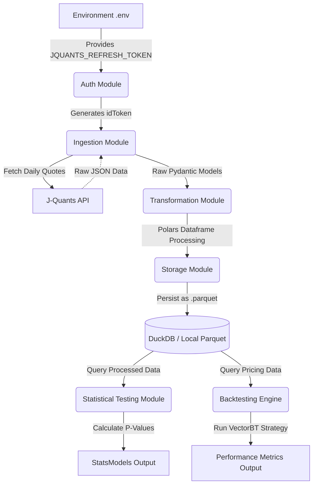

# SYSTEM ARCHITECTURE

## 1. Summary
This document describes the high-level architecture for the Japanese Stock Calendar Anomaly Verification System (Live API E2E). The goal of this system is to retrieve daily stock data from the J-Quants API, transform the data using Polars, and then analyze any day-of-the-week anomalies (calendar anomalies) statistically and computationally. The system is designed to provide robust backend infrastructure, using a pipeline composed of Data Ingestion, Transformation, Storage, and subsequently Statistical Analysis and Backtesting. It uses a modern technology stack with Python, Polars for rapid data manipulation, DuckDB for local scalable analytical storage, and VectorBT for efficient backtesting on financial data.

## 2. System Design Objectives
The primary objectives of this system architecture are to build a robust, reproducible, and verifiable environment for finding calendar anomalies in Japanese stocks. The main design criteria include:
- **Reproducibility**: The data pipeline and backtesting modules must act consistently so that any researcher or auditor can verify the generated statistics and trading signals.
- **Robustness**: The API fetching mechanism must implement robust retry logic to handle rate limiting and intermittent errors from the J-Quants API. It must never hardcode sensitive credentials like API keys or refresh tokens. Instead, the system must utilize `python-dotenv` or structured Pydantic settings that rely on environment variables securely.
- **Scalability**: By utilizing Polars for dataframe manipulations and DuckDB for columnar storage, the system should scale seamlessly beyond the initial Proof-of-Concept timeframe (e.g., beyond the requested 12-week subset), enabling analysis across several years of historical market data without consuming excessive memory.
- **Separation of Concerns**: The application logic must be thoroughly separated from the domain logic. Ingestion, transformation, and storage must be distinct modules. Statistical testing and backtesting must rely on domain abstractions without directly knowing how the data was ingested or persisted.
- **Testability**: The design mandates that unit tests, integration tests, and live End-to-End (E2E) tests are easy to orchestrate. Live E2E tests against the real J-Quants API (Free tier) are a strict requirement, verifying that the authentication and data ingestion workflows are functioning perfectly against actual network endpoints. The system must also decouple dependencies so that integration tests can be safely run offline or in a mocked context where necessary, especially for external APIs, utilizing a secure `.env` pipeline that prevents leakage.
- **Security**: Strict separation of credentials. A `.env.example` file must be provided. Loggers must be scrubbed of any secret tokens or passwords to prevent leakage into audit logs.
- **Modern Standards**: Type hints (Mypy strict), data validation (Pydantic), and fast execution capabilities form the foundation.

## 3. System Architecture
The system architecture revolves around two main pillars: The Data Pipeline (ETL & Storage) and the Analytical Engine (Backtesting & Statistics). The process begins with securely authenticating to the J-Quants API to acquire a refresh token and subsequent idToken. The system then queries the API for recent Japanese daily quotes.



**Boundary Management and Separation of Concerns:**
1. **Ingestion Boundary**: Responsible strictly for network interaction, authentication, and returning generic domain models representing the raw API response. It must not contain logic for aggregating data or calculating technical indicators.
2. **Transformation Boundary**: Responsible for taking raw domain data and manipulating it via Polars. It produces the specified features (day of week, beginning/end of month flags, overnight/intraday returns). It is stateless and side-effect free.
3. **Storage Boundary**: Handles the reading and writing of data to local persistent storage (Parquet files) and providing an interface via DuckDB.
4. **Analytical Boundary**: Consumes the processed data to produce statistics and performance metrics. It does not know where the data originated, only that it conforms to a specified schema.

## 4. Design Architecture
The file and folder structure enforces the separation of concerns.

```text
thejtc/
├── dev_documents/
├── src/
│   ├── __init__.py
│   ├── config.py           # Pydantic BaseSettings for App/Environment Config
│   ├── domain/             # Pydantic models for type safety
│   │   ├── __init__.py
│   │   ├── jquants.py      # Raw J-Quants API response schemas
│   │   └── features.py     # Schemas for transformed data
│   ├── ingestion/          # API Clients and Authentication
│   │   ├── __init__.py
│   │   ├── auth.py         # Handles JQUANTS_REFRESH_TOKEN auth
│   │   └── client.py       # Fetches quotes using tenacity retries
│   ├── transform/          # Polars transformation logic
│   │   ├── __init__.py
│   │   └── features.py     # Calculates return metrics and calendar flags
│   ├── storage/            # Local Persistence and DuckDB interface
│   │   ├── __init__.py
│   │   └── parquet_db.py   # Save/Load Parquet and DuckDB querying
│   └── analysis/           # Stats and Backtesting
│       ├── __init__.py
│       ├── stats.py        # Statsmodels logic for day-of-week returns
│       └── backtest.py     # VectorBT logic
├── tests/
│   ├── __init__.py
│   ├── conftest.py         # Pytest fixtures, mock env setups
│   ├── test_ingestion.py   # Live & mocked API tests
│   ├── test_transform.py   # Unit tests for Polars transformations
│   ├── test_storage.py     # DuckDB and Parquet tests (using tmp_path)
│   └── test_analysis.py    # Stats and VectorBT tests
├── .env.example
├── pyproject.toml
└── README.md
```

**Domain Pydantic Models Structure:**
The system uses Pydantic to ensure all inputs and outputs across boundaries are strongly typed.
- `JQuantsQuote`: Represents a single row of the raw API response.
- `TransformedQuote`: Extends the concept to include calculated fields such as `day_of_week`, `is_month_start`, `intraday_return`, and `overnight_return`.
- All environment variables are validated by a `Settings` class inheriting from `pydantic_settings.BaseSettings` with strict validation (`extra="forbid"`).

## 5. Implementation Plan

### CYCLE01
**Features:** Data Pipeline Construction (ETL & Storage)
This cycle involves building the foundation. The primary goal is connecting to the J-Quants API, safely authenticating, pulling the required 12-week data, performing the structural transformations with Polars, and saving the results locally to Parquet files via a DuckDB abstraction. The cycle ensures that environment variables are read correctly and that sensitive keys are not logged or exposed. It includes creating the foundational `config.py` and implementing `ingestion/auth.py`, `ingestion/client.py`, `transform/features.py`, and `storage/parquet_db.py`.

### CYCLE02
**Features:** Backtesting and Statistical Validation
This cycle introduces the analytical capabilities of the system. Utilizing the Parquet datasets created in Cycle 01, this cycle will implement the `analysis/stats.py` using `statsmodels` to verify if certain days exhibit statistically significant abnormal returns. Furthermore, it implements `analysis/backtest.py` utilizing `vectorbt` to build a trading simulation based on the discovered anomalies. The cycle will finish with complete integration tests proving the entire flow from API to statistical output functions flawlessly.

## 6. Test Strategy

### CYCLE01
- **Unit Testing**: Tests will use `pytest-mock` to isolate functions. The `transform/features.py` will be extensively unit tested using small, mocked Polars DataFrames containing known edge cases (e.g., a stock split date, missing data, weekend data).
- **Integration Testing**: Storage components will be tested by ensuring Polars can write to a temporary Parquet file provided by the Pytest `tmp_path` fixture and that DuckDB can correctly read it back.
- **Live E2E Testing**: A specific live test will connect to the J-Quants API using the actual credentials from `.env` to verify the ingestion logic and ensure rate limiting and pagination are correctly managed. This ensures the Free Tier requirements are actively validated.
- **DB Rollback Rule**: For any database-like tests, transient connections or temporary file paths (`tmp_path`) will be utilized strictly, ensuring lightning-fast state resets without side effects on local disk.

### CYCLE02
- **Unit Testing**: `statsmodels` outputs will be validated against synthetically generated normal distributions created via `numpy.random` to prevent precision loss or uniformity issues. `vectorbt` logic will be verified using predictable, straight-line price trends to ensure correct calculation of Sharpe ratios and cumulative returns.
- **Integration Testing**: The cycle will test the connection between the DuckDB/Parquet storage boundary and the analysis modules. Mocked local `.parquet` files generated in conftest will be passed into the analysis engines to verify correct typing and schema acceptance.
- **E2E Testing**: A complete dry-run of the pipeline (offline, using cached Cycle 01 data) will ensure the entire process executes end-to-end flawlessly, guaranteeing verifiable research outputs.
